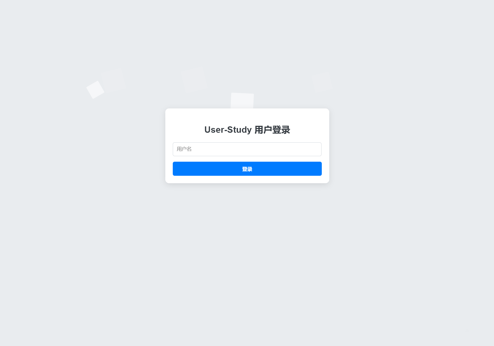
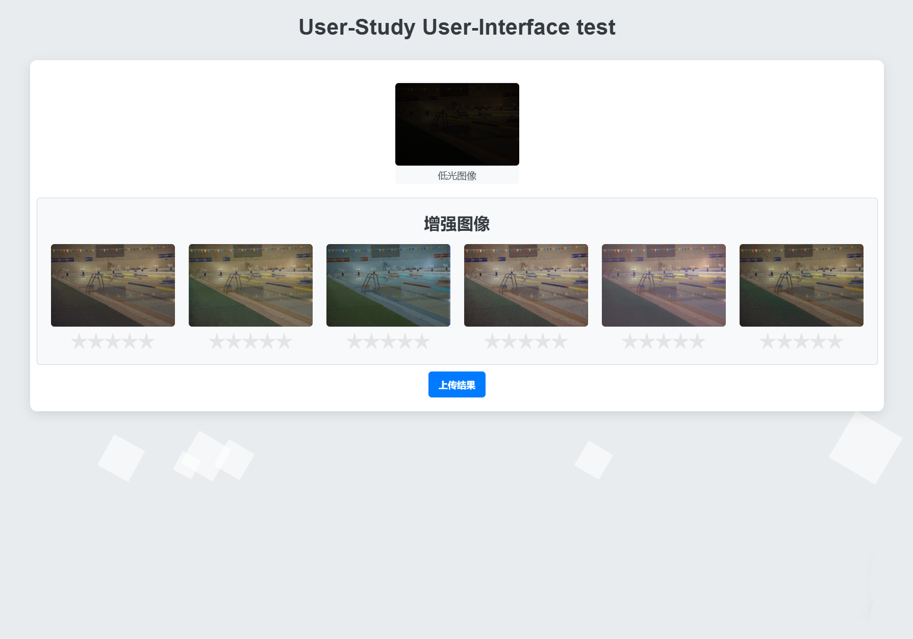
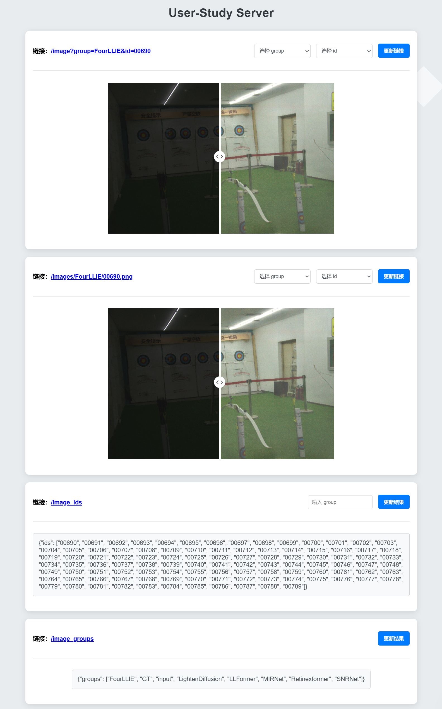

# Easy User-Study Server

## 项目结构

### 服务器部分
创建的服务器是 IP 服务器
- IP 地址为电脑连上的局域网的 IP 地址
- 端口号为 8000
```txt
└── server.py         // 服务器主文件
```

### 前端模板
这个是用来做参考的
```txt
├── index.html        // 主HTML文件
├── style.css         // 主样式文件
├── script.js         // 主JavaScript文件
├── /assets           // 静态资源
│   ├── /images       // 存放图片
│   ├── /fonts        // 存放字体
│   └── /videos       // 存放视频
├── /css              // 存放样式文件
│   ├── reset.css     // 重置样式文件
│   ├── layout.css    // 布局样式文件
│   └── components.css // 组件样式文件
├── /js               // 存放JavaScript文件
│   ├── app.js        // 应用逻辑主文件
│   ├── utils.js      // 工具函数
│   └── api.js        // API请求相关代码
├── /components       // 存放可重用的组件
│   ├── Header.js     // 头部组件
│   ├── Footer.js     // 底部组件
│   └── Modal.js      // 模态框组件
├── /pages            // 不同页面的结构（如果有多个页面）
│   ├── Home.html     // 首页
│   ├── About.html    // 关于页
│   └── Contact.html   // 联系页
└── /tests            // 存放测试文件
    ├── app.test.js   // 应用逻辑测试
    └── utils.test.js  // 工具函数测试

```

## 使用指南

### 快速开始

#### 克隆项目
```shell
git clone https://github.com/Yangzhichen763/Easy-User-Study-Server.git
cd Easy-User-Study-Server
```
#### 配置环境
```shell
pip install -r requirements.txt
```
#### 启动服务器
```shell
python server.py
```
启动完服务器后：
- 访问 `http://{IP地址}:8000` 即可看到 User-Study 的登录页面
- 访问 `http://{IP地址}:8000/server` 即可看到服务器中的内容

### 自定义

- 自定义首页：在 `index.html` 中进行修改
- 自定义 User-Study 界面：在 `pages/interface.html` 中进行修改
  - 在 `pages/templates/` 中有一些预设的模板，可以直接使用吗，比如：
    - `interface_click.html` 文件专注于选择更好的图片
    - `interface_rating` 专注于评分图片）
- 自定义服务器内容：在 `server.py` 的 `UserStudyHandler` 中进行修改
  - 对于需要通过少量参数获取的数据，在 `do_GET` 函数中添加条件分支
  - 对于需要通过大量数据获取的数据，在 `do_POST` 函数中添加条件分支

## 界面展示

### 登录界面



### User-Study 界面



### 服务器内容

